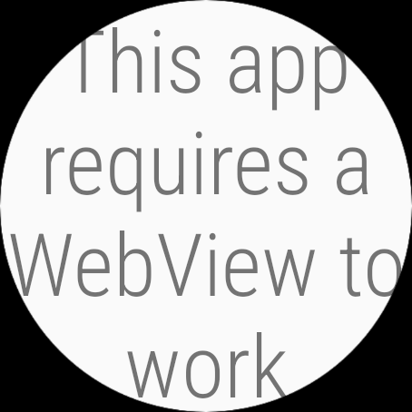
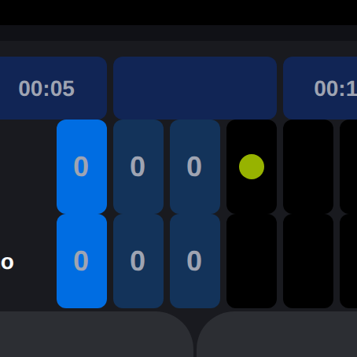
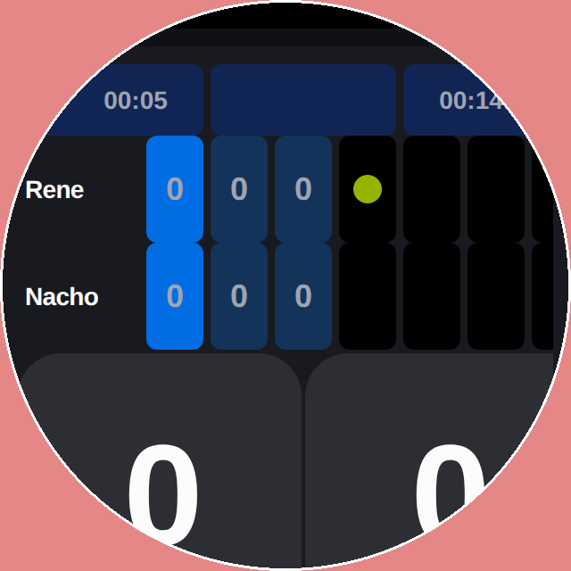
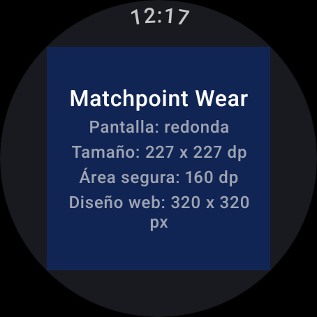

# Wear OS — Fases 0 y 1: hechas y verificadas

Fecha: 2026-09-10 · Rama `wearOS` · Sin commit (working tree)

## Fase 0 — Prototipo: la premisa se confirma, y con más fuerza

**Emulador.** AVD `matchpoint_wear`, imagen `system-images;android-34;android-wear;x86_64`,
**454 × 454 px @ 320 dpi redonda** → `wm size` 454x454, `ro.build.characteristics=watch`.

```bash
~/Android/Sdk/emulator/emulator -avd matchpoint_wear -no-snapshot-save -gpu swiftshader_indirect
```

### Hallazgo 1 — el APK de Capacitor **no corre**: la imagen Wear no trae WebView

`adb install` del APK de teléfono funciona, pero al abrir muestra
*"This app requires a WebView to work"* y `BridgeActivity` revienta en `onSaveInstanceState`.

```
$ adb shell pm list packages | grep -iE "webview|chrome"   → (vacío)
$ adb shell dumpsys webviewupdate                          → Can't find service
```



No hay **ningún** proveedor de WebView en la imagen Wear x86_64. Los relojes reales sí
traen uno, así que esto es limitación del emulador — pero significa que la ruta A
(Capacitor por sideload) **ni siquiera se puede validar aquí**. Refuerza la decisión B.

### Hallazgo 2 — el layout de 320 px no entra: sobra un 41 %

El marcador está fijado en px (`partido.tsx:318,364,373,389`): grilla `w-[320px] h-[160px]`
+ dos botones `160×160`. En la web 1 px CSS = 1 dp, y el reloj mide **227 × 227 dp**
(454 px / densidad 2.0). Es decir el diseño pide 320 dp donde hay 227 → **se sale por
derecha y por abajo**, no es que "pierda las esquinas".

Render de `/partido` al viewport real del reloj (227 × 227 dp):



Y a su tamaño nativo (320 dp), con el bisel redondo pintado encima — en rojo lo que el
reloj no muestra:



Incluso a 320 dp se pierde: el cronómetro derecho queda cortado, las columnas 8-9 de la
grilla caen fuera y los dos "0" grandes de los botones quedan mordidos por abajo.

**Área útil real:** cuadrado inscrito = 454 / √2 = 321 px = **160 dp**. O sea el 64 % del
área del círculo. Todo lo que deba leerse completo cabe en 160 × 160 dp.

### Hallazgo 3 — el apagado a los ~15 s no se puede medir aquí

`settings get system screen_off_timeout` → `2147483647` en el AVD (pantalla siempre
encendida). El default de Wear OS real son 15 s; queda pendiente de medir en reloj físico.
No cambia nada del plan: la Fase 4 (ambient + ongoing activity) sigue siendo necesaria.

## Fase 1 — Módulo `wear/`: compila, instala y arranca

Proyecto Gradle **independiente** de `android/` (ese lo regenera `npx cap sync` y se
llevaría por delante cualquier módulo que le agreguemos).

| Pieza | Valor |
|---|---|
| Gradle / AGP / Kotlin | 8.9 / 8.7.3 / 2.1.0 (JDK 17 de esta máquina) |
| `applicationId` | `cl.matchpoint.marcador.wear` (sufijo `.wear` → convive con la app de teléfono) |
| min / target / compile SDK | 30 / 35 / 35 |
| UI | Compose + `androidx.wear.compose:compose-material3:1.5.6` (+ foundation, navigation) |
| Manifest | `uses-feature android.hardware.type.watch required=true` + `wearable.standalone=true` |
| Firma release | la misma keystore del teléfono (`android/matchpoint-release.jks`) |

Fuentes: `MainActivity` (AppScaffold → TimeText nativo), `theme/Color.kt` (paleta oklch de
`src/styles.css` traducida a sRGB) y `DeviceCheckScreen`, que imprime las medidas del
reloj — que son justo la entrada de la Fase 3.

```bash
cd wear && ANDROID_HOME=~/Android/Sdk ./gradlew assembleDebug     # BUILD SUCCESSFUL (27 s)
                                       ./gradlew assembleRelease  # BUILD SUCCESSFUL (84 s)
adb install -r app/build/outputs/apk/release/app-release.apk
adb shell am start -n cl.matchpoint.marcador.wear/.presentation.MainActivity
```

Release verificado: `apksigner` firma `CN=Matchpoint, O=Matchpoint, C=CL` (la misma del
teléfono), `aapt2` confirma `sdkVersion:'30'` / `targetSdkVersion:'35'` /
`uses-feature android.hardware.type.watch`. Corre sin crashes (`logcat -b crash` limpio):



## Pendientes que dejan estas fases

- **APK pesado**: 27 MB debug / 21 MB release, sin minify. Wear Compose completo. Activar
  R8 + `resConfigs` antes de publicar.
- Medir el apagado de pantalla y el consumo en un **reloj físico** (no hay ninguno aquí).
- Fase 2: portar el reducer de `partido.tsx:24-193` a `MatchState.kt` + tests JVM.
- Fase 3: maquetar en **dp con pesos** sobre el cuadrado seguro de 160 dp, nunca en px.
