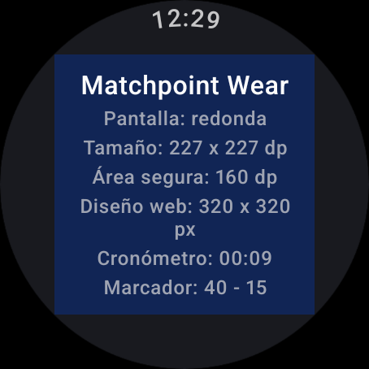

# Wear OS — Fase 2: lógica portada a Kotlin

Fecha: 2026-09-10 · Rama `wearOS` · Sin commit

## Qué se hizo

| Archivo | Qué es |
|---|---|
| `domain/MatchState.kt` | Port 1:1 de `partido.tsx:24-193`. Kotlin **puro**: sin Android, Compose ni corrutinas. |
| `domain/MatchViewModel.kt` | `StateFlow<MatchState>` + cronómetro. Nada de reglas: sólo expone [`reduce`]. |
| `test/…/MatchTest.kt` | **25 tests JVM**, todos verdes. |

```bash
cd wear && ANDROID_HOME=~/Android/Sdk ./gradlew testDebugUnitTest
# 25 tests, 0 fallidos · informe en app/build/reports/tests/testDebugUnitTest/index.html
```

## Cobertura de los tests

Los casos que la app web nunca tuvo probados:

- **Game normal**: 40-0 cierra, 40-30 no; el saque cambia de mano en cada game.
- **Deuce**: 40-40 → `DC`, ventaja `AD`, ventaja perdida vuelve a `DC`, deuce largo (5 idas
  y vueltas) y cierre con dos puntos seguidos.
- **Cierre de set**: 6-0 cierra y **ambos** avanzan de set; 6-5 no cierra; 7-5 sí.
- **Tie break**: 6-6 lo activa y los puntos pasan a ser el número real; 7-0 cierra 7-6;
  7-6 **no** alcanza (hace falta diferencia de 2), 8-6 sí.
- **Fin del partido**: 2 sets de 3, ganador correcto, el tercer set no se juega, el
  partido a tres sets lo gana quien gana el último, y **terminado el partido el marcador
  queda congelado**.
- **Correcciones**: undo no baja de cero, `resetGame` limpia puntos y deuce pero no games,
  editar games a mano no baja de cero, `toggleServe`.
- **Cronómetro**: `formatElapsed` en `MM:SS`, `H:MM:SS` pasada la hora, y negativo → `00:00`.

## Tres diferencias deliberadas con el TypeScript

1. **`point`/`undoPoint` no hacen nada con el partido terminado.** En la web eso lo impedía
   el `disabled` del botón, no el reducer. En el reloj no hay botón en quien confiar, así
   que la regla vive donde se puede probar.
2. **Las etiquetas de tie break se generan.** El arreglo `POINTS_TIEBREAK` de la web llega
   sólo hasta `"10"`; de ahí en adelante caía en el número crudo por el `??`. Ahora es
   siempre el número.
3. **El super tie break existe, apagado por defecto.** `MAX_SUPER_TIEBREAK_POINTS = 11`
   está declarada en la web pero **nunca se usa**. Aquí es `Rules.superTiebreak`
   (`false` = comportamiento idéntico al de la web); en `true`, el set decisivo se juega
   como tie break a 11 con 2 de diferencia. Ambos caminos están probados.

Las constantes `MAX_GAMES_TIEBREAK` y `GAMES_CHANGE_SIDE` de la web tampoco se usan; no se
portaron. `GAMES_CHANGE_SIDE` (cambio de lado cada 2 games impares) es candidata para la
Fase 3, si se quiere avisar en el reloj.

## Prueba de humo en el reloj

`DeviceCheckScreen` instancia el `MatchViewModel` y reparte la pantalla en dos mitades
(izquierda = punto local, derecha = visitante) — provisional, la UI real es la Fase 3.
Tres toques a la izquierda y uno a la derecha en el emulador:



`Marcador: 40 - 15` y el cronómetro corriendo: el reducer, el `StateFlow` y el tick de un
segundo funcionan dentro del reloj, no sólo en la JVM. Sin crashes (`logcat -b crash` limpio).

## Lo que queda apuntado para la Fase 3

- `MatchState` ya expone todo lo que la UI necesita **derivado**, no calculado en la
  pantalla: `closedSets`, `homeSetsWon`/`awaySetsWon`, `matchOver`, `winner`, `pointLabel()`.
  En la web esto vivía dentro del componente.
- La hora del reloj **no** la lleva el ViewModel: en Wear la pinta `TimeText` del sistema.
- El cronómetro se congela al terminar el partido, igual que el `stoppedAtRef` de la web.
