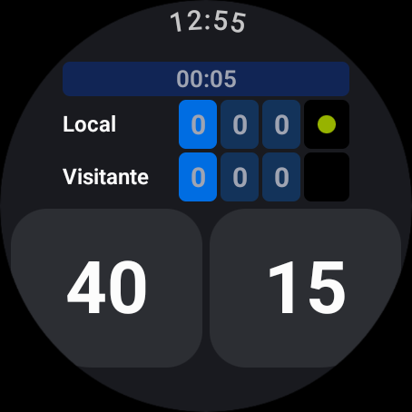
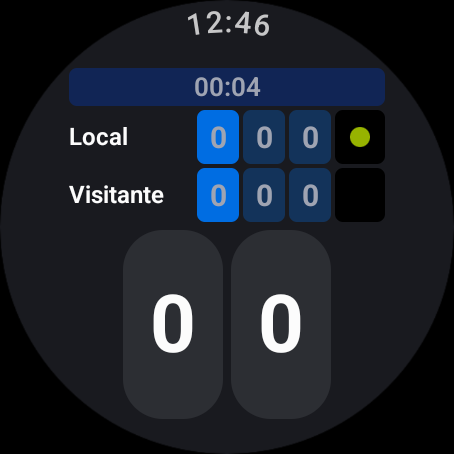
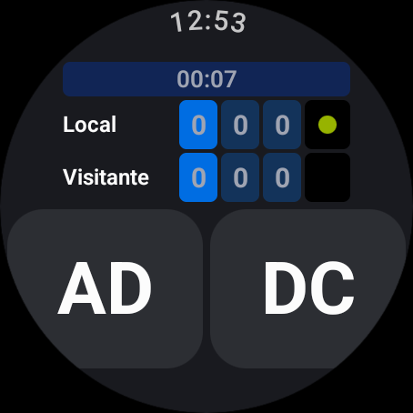
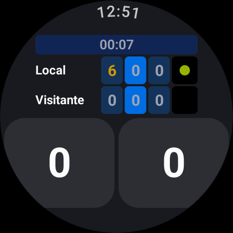
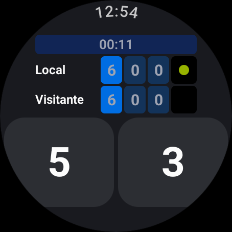
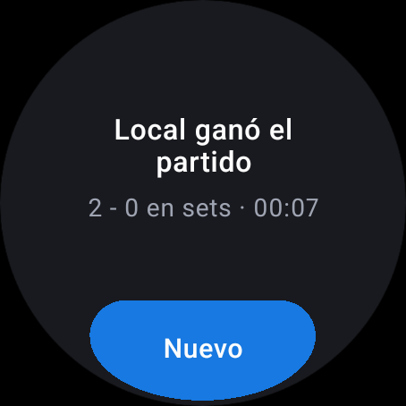

# Wear OS — Fase 3: el marcador en el reloj

Fecha: 2026-09-10 · Rama `wearOS` · Sin commit

`presentation/ScoreboardScreen.kt` reemplaza a `DeviceCheckScreen` en el arranque. La
lógica no se tocó: la pantalla sólo pinta el `MatchState` de la Fase 2 y despacha acciones.

## Lo que pedía el plan, y cómo quedó

| Punto del plan | Cómo se resolvió |
|---|---|
| `AppScaffold` + `TimeText` | `AppScaffold` en `MainActivity` ya pone el `TimeText` del sistema en el arco superior. **La hora dejó de dibujarse a mano**: la fila 0 se queda sólo con el cronómetro. No se usa `ScreenScaffold` — ése es para pantallas con scroll y el marcador cabe entero. |
| Todo en dp, con pesos | No queda un solo tamaño heredado de los 320 px. Todo sale de `BoxWithConstraints` en fracciones de la pantalla; las filas y las celdas de set reparten por `weight`. |
| Pantalla redonda | Dos tratamientos distintos, ver abajo. |
| Toque = punto, long-press = deshacer | `combinedClickable(onClick, onLongClick)`. En la web deshacer era clic derecho, que en el reloj no existe. |
| Corona / rotary | Girar suma o quita un punto al jugador que saca. |
| Háptica en cada punto | `TextHandleMove` al sumar, `LongPress` al deshacer. |
| Diálogo de fin | `AlertDialog` de Wear con el ganador, el marcador en sets y el tiempo. |

## Pantalla redonda: dos problemas distintos

**El tablero** (cronómetro + las dos filas) se mete hacia adentro exactamente lo que el
bisel le come *a su altura*: `inset = r - √(r² - y²)`, calculado en su borde superior, que
por estar más lejos del centro es el punto más estrecho. Son ~35 dp por lado de los 227.

**Los botones de punto** no se pueden tratar igual. Su borde inferior está tan abajo que
el mismo cálculo pide 60 dp por lado y deja dos tiras inservibles — que fue exactamente lo
que salió en el primer intento:

La solución es al revés: los botones van casi de borde a borde y **lo que sobresale se
redondea**, con un radio del tamaño de la curva del bisel (20 % del alto de la pantalla)
en las dos esquinas de abajo. Medido sobre la captura real: **0 píxeles del botón caen
fuera del círculo**, y el borde llega a 226,6 px de un radio de 227 — la curva del botón
sigue la del bisel. Como el radio es una fracción de la pantalla, vale igual en un reloj
de 192 dp que en uno de 227.

## La corona venía con el signo cambiado

`RotaryScrollEvent.verticalScrollPixels` llega **invertido** respecto de `AXIS_SCROLL`:
girar hacia adelante entrega un valor negativo (es la convención de "scroll que avanza").
Comprobado en el emulador con `adb shell input rotaryencoder scroll --axis SCROLL,±3`: con
el signo directo, girar hacia adelante *deshacía* puntos. Los deltas vienen en píxeles y se
acumulan hasta un umbral de 40 para que un giro suave no dispare una ráfaga.

## Botón "Nuevo"

La web sale del partido con un enlace *Nuevo match* a `/preparar`. En el reloj no hay tal
pantalla todavía (Fase 5), así que sin nada la app quedaba muerta al terminar: el diálogo
lleva un `EdgeButton` que reinicia marcador y cronómetro. Los nombres siguen siendo
`Local` / `Visitante` hasta que exista la preparación.

## Verificado en el emulador (454×454 redondo)

| Caso | Captura |
|---|---|
| Toque = punto (40-15) y long-press = deshacer (40→30) |  |
| Deuce y ventaja (`DC` / `AD`) |  |
| Set cerrado 6-0: pasa a azul marino, el ganador en ámbar, el set 2 en azul eléctrico |  |
| Tie break a 6-6: los puntos pasan a ser el número real |  |
| Fin del partido: diálogo, cronómetro congelado, botones apagados |  |

Además: la corona suma y resta en las dos direcciones, "Nuevo" reinicia todo, y
`logcat -b crash` queda limpio en toda la sesión. Los 25 tests de la Fase 2 siguen verdes.

## Lo que queda pendiente

- **No hay reloj cuadrado para probar.** La rama `else` (sin bisel: 4-6 dp de margen y
  esquinas de 20 dp) sólo está vista en `@Preview`, no renderizada.
- **La pantalla se apaga a los ~15 s** en un reloj real. `androidx.wear.compose.material3`
  trae un composable `KeepScreenOn()` de una línea, pero eso es Fase 4 junto con ambient
  mode y la Ongoing Activity.
- **El set que nunca se juega se pinta como "en juego"** (azul eléctrico) al terminar el
  partido 2-0. Es fiel a la web, donde pasa igual; si molesta, se apaga mirando `matchOver`.
- Nombres de los jugadores: Fase 5.
