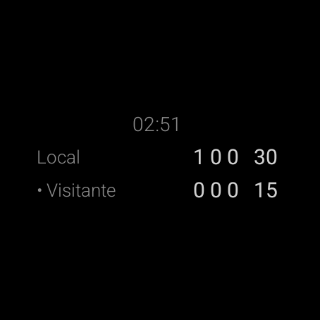
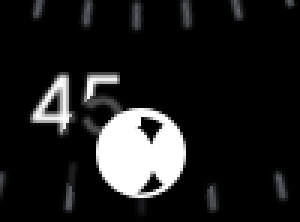
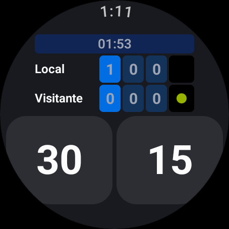

# Wear OS — Fase 4: sesión larga

Fecha: 2026-09-10 · Rama `wearOS` · Sin commit

Lo que hacía falta para que un partido de dos horas sobreviva: que la pantalla se pueda
apagar, que el sistema no mate la app, y que si igual la mata no se pierda el marcador.

| Pieza | Archivo |
|---|---|
| Ambient mode (always-on de bajo consumo) | `presentation/AmbientScoreboard.kt` + `MainActivity` |
| Ongoing Activity + servicio en primer plano | `service/MatchService.kt` |
| Persistencia en DataStore | `data/MatchRepository.kt` + `MatchViewModel` |

Dependencias nuevas: `androidx.wear:wear-ongoing:1.0.0`,
`androidx.datastore:datastore-preferences:1.1.1`, `kotlinx-serialization-json:1.7.3`
(con el plugin `org.jetbrains.kotlin.plugin.serialization`).

## Ambient

`AmbientLifecycleObserver` deja la actividad *always-on*: al apagarse el reloj no se cierra,
cambia a [`AmbientScoreboard`]. Es la respuesta correcta al "se apaga a los ~15 s" que quedó
pendiente en la Fase 0 — mejor que `KeepScreenOn()`, porque tener la pantalla a pleno brillo
dos horas es justo lo que se quería evitar.

Qué cambia respecto de la pantalla normal, y por qué:

- **Fondo `#000000` puro**, no el gris azulado de la app: en OLED un píxel negro no consume.
  Es el riesgo que el plan anotó sobre la paleta.
- **Sin rellenos de color**: las celdas de set pasan a texto y la pelota de saque a un punto.
- **Texto fino y gris**, no blanco en negrita.
- **Anti-quemado**: si el reloj lo pide (`burnInProtectionRequired`), todo se desplaza unos
  píxeles siguiendo el minuto del cronómetro.
- **El cronómetro deja de latir cada segundo.** En ambient el sistema despierta la app una
  vez por minuto (`onUpdateAmbient`) y ése pasa a ser el único refresco: un tick de 1 s en
  ambient sería gastar batería para nada.

En el emulador se entra con `adb shell input keyevent 223` (palm) y se sale con `224`
(tilt). Al salir el cronómetro se pone al día de golpe.

## Ongoing Activity

`MatchService` es un servicio en primer plano que publica el marcador como *Ongoing
Activity*: mientras el partido corre queda un ítem en el watch face, y el sistema no mata
la app.

No recibe el marcador por el intent: **lee el mismo DataStore que escribe el ViewModel**,
así no hay dos fuentes de verdad ni binding que mantener. Arranca cuando hay partido en
juego y se detiene solo cuando termina — verificado: con el partido cerrado,
`dumpsys activity services MatchService` y la notificación quedan en cero.

Detalles que costaron:

- **`foregroundServiceType="specialUse"`.** Con targetSdk 35 hay que declarar tipo. No es
  `health` (no medimos nada del cuerpo, y ese tipo pide permisos de sensores) ni `dataSync`;
  es un marcador que el usuario deja corriendo, así que `specialUse` con su
  `PROPERTY_SPECIAL_USE_FGS_SUBTYPE`. Confirmado en el dump: `types=40000000`.
- **`POST_NOTIFICATIONS` es permiso de ejecución** en Wear 4+: sin él no hay Ongoing
  Activity. Se pide al abrir la app.
- **El servicio se mataba solo al arrancar.** El flujo del repositorio emite `null` cuando
  todavía no hay nada escrito, y la primera versión lo trataba como "partido terminado" →
  `stopSelf()` antes de que el ViewModel guardara el primer punto. Ahora `null` no para
  nada, y el ViewModel guarda ya en el arranque.

## Persistencia

El partido entero se guarda como JSON en una única clave de DataStore. Es un objeto anidado
(dos jugadores, listas de games, reglas): repartirlo en claves sueltas sólo abriría la
puerta a guardarlo a medias.

Se persiste `MatchState` + `startedAt` + `stoppedAt`, así el **cronómetro también sobrevive**:
al volver, sigue contando desde el instante original, no desde cero.

Las clases del dominio llevan `@Serializable` en vez de tener un DTO paralelo que se
desincronice. kotlinx.serialization es un plugin de compilación, así que el dominio sigue
sin dependencias de Android y los tests siguen corriendo en la JVM pelada.

Un JSON de una versión anterior del modelo **se descarta** en vez de reventar: si no, un
cambio en el estado dejaría la app sin arrancar y sin manera de recuperarse.

Probado con `am force-stop` + relanzar: vuelve el marcador y el cronómetro sigue donde iba.

## Tests

**28 tests JVM, todos verdes** (25 de la Fase 2 + 3 nuevos de serialización):

- Un partido en tie break vuelve **idéntico** del JSON (si se pierde el flag de tie break o
  el índice de set, el partido se retoma mal y no hay forma de notarlo).
- Reglas no estándar (super tie break, 5 sets) y cronómetro detenido sobreviven.
- Un JSON de otra versión devuelve `null`, no lanza.

## Pendiente

- **El consumo real de batería no se puede medir en el emulador.** Ambient se ve y se
  comporta, pero cuánto dura un partido de dos horas en un reloj físico sigue sin saberse.
- El release pesa **23,3 MB** sin minify (era 21,4 antes de la Fase 4). R8 antes de publicar.
- `specialUse` exige justificación al subir a Play. La razón está escrita en el manifest.
