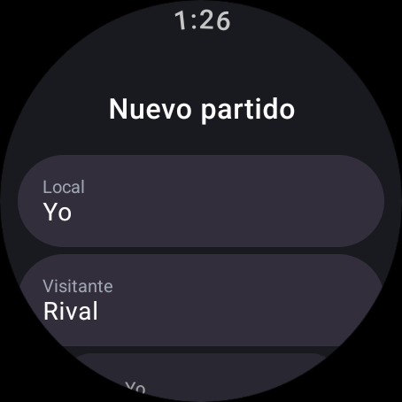
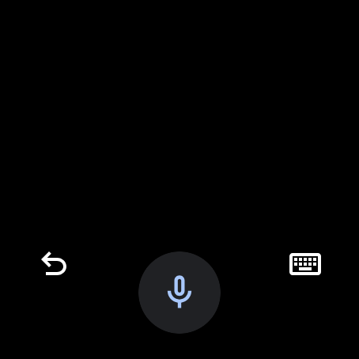
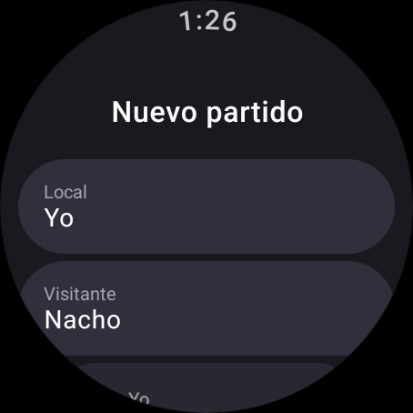
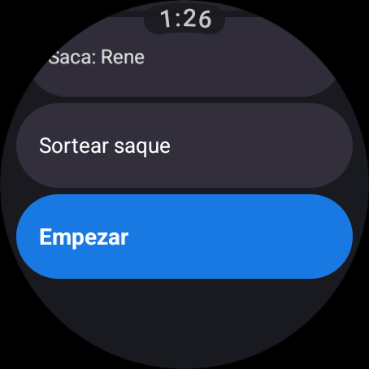
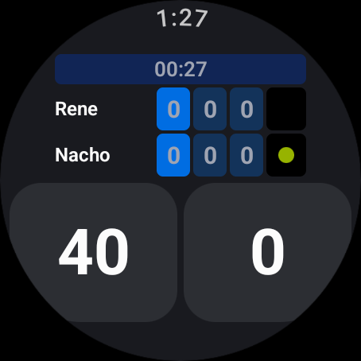
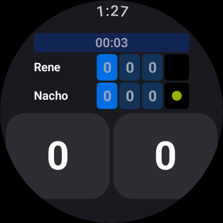

# Wear OS — Fase 5: preparación del partido, sin login

Fecha: 2026-09-10 · Rama `wearOS` · Sin commit

El plan daba tres opciones **en orden**: (1) app standalone sin login con el nombre del
rival por voz, (2) Data Layer API para recibir perfil y token del teléfono, (3) Supabase
directo en el reloj. Se implementó la **(1)**. Al final está por qué no las otras dos.

## `PrepararScreen`

Es la pantalla `preparar` de la web, reducida a lo que sirve en un reloj: dos nombres, el
sorteo del saque, y empezar.

**No hay identidad.** Escribir un email y una contraseña en una pantalla de 2,5 cm es mal
negocio, y era justo el argumento del plan para sacar el login del reloj en v1.

**El nombre entra por dictado.** Tocar una fila lanza
`RecognizerIntent.ACTION_RECOGNIZE_SPEECH`; en Wear lo atiende el panel de entrada del
sistema, que ofrece voz, teclado y escritura a mano — el usuario elige.

 

No hizo falta ninguna dependencia extra: el intent es del SDK y en el emulador lo resuelve
`WearRemoteInputActivity` de Gboard. Si un reloj no tuviera panel de entrada, el
`launch` se atrapa y la pantalla lo dice en vez de cerrarse.

**Los nombres se recuerdan** entre partidos (DataStore, junto al partido de la Fase 4):
dictar cuesta y normalmente se juega contra el mismo rival.

**El sorteo** lo hace el reloj (`Random.nextBoolean()`, con háptica). La fila "Saca: …"
también se toca para alternarlo a mano, por si la moneda se lanzó de verdad en la cancha.

## Qué pasó con el arranque

Ahora hay dos pantallas, y cuál se abre lo decide el estado guardado:

| Estado en disco | Abre en |
|---|---|
| Partido a medias (algún punto jugado, sin terminar) | Marcador, retomado |
| Sin partido, o partido terminado | Preparar |

Para eso se agregó `MatchState.empezado` al dominio — puro y probado. Mientras no se haya
leído el disco **no se dibuja nada**: abrir en la pantalla equivocada y saltar a la otra se
ve como un parpadeo.

El botón **"Nuevo"** del diálogo de fin ya no reinicia con nombres por defecto: vuelve a la
preparación.

**No se usa `SwipeDismissableNavHost`** (y se quitó la dependencia `compose-navigation`, que
había quedado sin uso desde la Fase 1). Son dos pantallas, y el gesto de volver atrás en
medio de un partido sacaría del marcador sin querer. La navegación es un `when` sobre un
estado.

También se ajustó el servicio en primer plano de la Fase 4: ahora vive mientras
`empezado && !matchOver`, así no aparece la Ongoing Activity mientras se prepara el partido.

## Probado en el emulador

Ciclo completo, sin crashes: preparar → dictar "Nacho" y "Rene" (por teclado, el emulador no
tiene micrófono; el intent y el `EXTRA_RESULTS` son los mismos) → sortear → Empezar →
marcador con los nombres y el saque sorteados → `force-stop` y relanzar → **retoma el
partido** → terminarlo → "Nuevo" → preparar **con los nombres recordados**.

**32 tests JVM verdes** (los 28 anteriores + 4 de `empezado`: recién creado no cuenta, un
punto sí, un game ganado también aunque los puntos vuelvan a cero, y deshacer hasta cero lo
deja otra vez sin empezar).

## Por qué no las opciones 2 y 3

- **(2) Data Layer API.** Es la buena si se quiere el perfil real del usuario en el reloj,
  pero obliga a meter un `WearableListenerService` y `play-services-wearable` en la app de
  teléfono, que es Capacitor: ese `android/` **lo regenera `npx cap sync`** y el módulo se
  perdería en cada build. Habría que sacarlo a un plugin de Capacitor o a un `android/app/src`
  versionado aparte. Es trabajo de otra fase, no un detalle.
- **(3) Supabase en el reloj.** El propio plan la marca como último recurso, y con (1)
  funcionando no hace falta: la app no necesita saber quién eres para contar puntos.

## Pendiente

- **El "lado" (cambio de cancha) no está.** La web tiene la constante `GAMES_CHANGE_SIDE = 5`
  pero **no la usa**, y el dominio portado tampoco lo modela. Si se quiere avisar el cambio
  de lado, es una regla nueva, no un port.
- Dictado real no probado: el emulador no tiene micrófono. Falta reloj físico.
- El release pesa **22,1 MB** sin minify.
