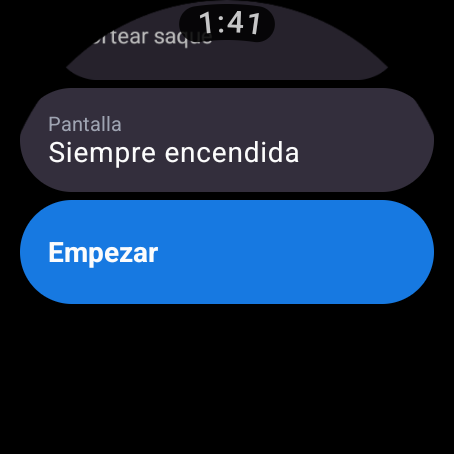
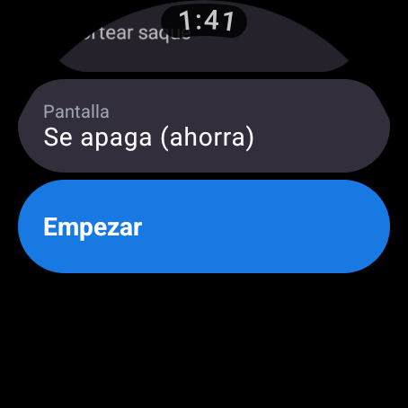
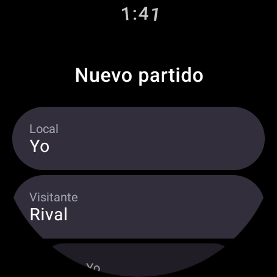
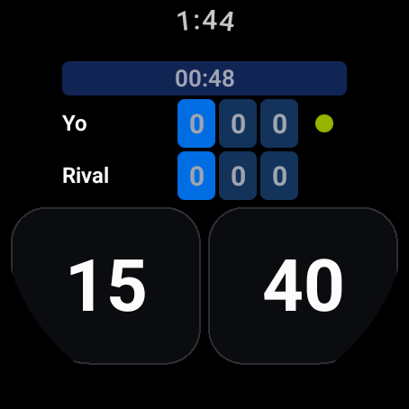
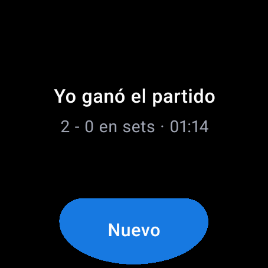

# Fase 6 — Batería

Optimización de consumo de la app de reloj. Punto de partida: la Fase 5 dejó un marcador
que funciona, pero pensado para que se vea bien, no para que dure. Un partido de tenis son
**dos horas** y un Wear típico tiene ~300 mAh: todo lo que despierte la CPU, encienda
píxeles o toque la radio se paga en porcentaje de batería al terminar de jugar.

| Qué se tocó | Dónde |
|---|---|
| Pantalla siempre encendida: ahora es opcional y se cae sola en ahorro de energía | `MainActivity`, `AhorroEnergia.kt`, `PrepararScreen` |
| Cronómetro: no cuenta si nadie mira, y en ambient no tiene bucle propio | `MatchViewModel` |
| Notificación / Ongoing Activity: local, silenciosa y sólo con la app en segundo plano | `MatchService` |
| Paleta OLED: fondo y botones casi negros | `theme/Color.kt`, `ScoreboardScreen` |
| Escrituras en flash confladas y sin escrituras inútiles | `MatchViewModel`, `MatchRepository` |
| Recomposición: cronómetro aislado, dominio estable, estilos constantes | `ScoreboardScreen`, `compose_stability.conf` |
| R8 + shrink de recursos en release | `build.gradle.kts`, `proguard-rules.pro` |

---

## 1. Lo que más gasta: la pantalla encendida

El always-on (ambient) mantiene el OLED encendido las dos horas del partido en vez de
dejar que el reloj se apague y despierte al levantar la muñeca. Ningún truco de código
ahorra tanto como no encenderlo, así que ahora hay **tres condiciones** y las tres tienen
que cumplirse (`MainActivity.WearApp`):

```kotlin
val pantallaSiempre = enJuego && siempreEncendido && !ahorroActivo
```

1. **`enJuego`** — sólo con un partido empezado y sin terminar. Antes el observador se
   registraba en `onCreate` y no se soltaba nunca: quedarse en la pantalla de preparación,
   o dejar la app abierta después del último punto, mantenía el reloj encendido
   indefinidamente.
2. **`siempreEncendido`** — ajuste del usuario, en la pantalla de preparación. Se pregunta
   antes de empezar, que es cuando uno sabe si va a jugar un set suelto o un partido largo
   con la batería a medias. Se recuerda entre partidos (DataStore).
3. **`ahorroActivo`** — si el reloj entró en modo de ahorro de energía, el always-on se cae
   solo (`AhorroEnergia.kt`). Es la única concesión automática de la app; el partido se
   sigue guardando igual. El `BroadcastReceiver` se registra **sólo mientras hay partido**.

| Siempre encendida | Se apaga (ahorra) |
|---|---|
|  |  |

Capturas tomadas del **APK release** corriendo en el emulador:

| Preparar | Marcador | Ambient | Fin |
|---|---|---|---|
|  |  |  |  |

## 2. El cronómetro

Es lo único de la app que despierta la CPU sin que el usuario toque nada. Tres reglas, en
`MatchViewModel`:

- **Nadie mirando, nadie contando.** `elapsed` se produce con
  `SharingStarted.WhileSubscribed(1 s)` y la UI lo consume con
  `collectAsStateWithLifecycle`. Al parar la actividad el productor muere solo. Antes el
  bucle de 1 s seguía girando dentro de `viewModelScope`: hasta **7.200 despertares por
  partido** dibujando sobre una pantalla apagada.
- **Un despertar por cambio visible.** El `delay` se alinea al borde del segundo que se
  muestra en vez de sumar 1.000 ms sobre el momento en que tocó ejecutarse, y al congelarse
  el partido el bucle **termina** en lugar de seguir girando.
- **En ambient no hay bucle.** El sistema despierta la app una vez por minuto
  (`onUpdateAmbient`) y ése es el único refresco; el texto pasa a `H:MM`
  (`formatElapsedCorto`), porque unos segundos refrescados cada 60 s serían mentira — y son
  dos dígitos encendidos durante dos horas.

## 3. La notificación (Ongoing Activity)

Una notificación en Wear no es un dibujo barato. Cinco correcciones, por orden de lo que
costaban:

1. **`setLocalOnly(true)`.** Sin esto cada actualización del marcador se puenteaba por
   Bluetooth al teléfono. Un partido son ~200 puntos: 200 encendidos de radio y 200
   notificaciones que nadie pidió.
2. **Con la app en pantalla el servicio no hace nada.** La Ongoing Activity sólo se ve en
   el watch face, o sea justo cuando la app *no* está delante. Mientras el marcador esté a
   la vista (ambient incluido) el flujo se corta entero: ni se lee el disco, ni se parsea
   el JSON, ni se notifica. Medido en el emulador: 4 puntos con la app delante →
   `numUpdatedByApp=0`; al volver al watch face → exactamente **1** actualización.
3. **Canal de importancia baja, silencioso y `onlyAlertOnce`.** El canal era
   `IMPORTANCE_DEFAULT`, o sea con derecho a vibrar y sonar en cada punto. La importancia
   de un canal ya creado no se puede bajar por código: hay que borrarlo y crear otro.
4. **Sólo se notifica si el texto cambió**, y el `PendingIntent` y el `NotificationManager`
   se cachean.
5. **Un servicio resucitado por `START_STICKY` sobre un partido rancio se apaga solo** a
   las 8 horas, en vez de quedarse encendido para siempre. Y la notificación lleva acción
   **Cerrar** para soltarlo desde el watch face sin abrir la app.

## 4. Píxeles

En OLED un píxel negro no pide corriente, y el fondo es la superficie más grande que hay.

- Fondo de la app: `#191A1F` → **`#000000`**. A simple vista no se distingue.
- Relleno de los dos botones de punto (casi media pantalla): `#2C2E33` → **`#0B0C0F`**,
  con un contorno que marca dónde tocar. El número de 40 sp ya dice de sobra dónde está
  cada botón. *Si algún día se prefiere el aspecto de la web, estos dos valores son lo
  único que revertir.*
- Ambient: negro puro, sin rellenos de color, texto fino y gris, sin segundos, y
  desplazamiento anti-quemado de 9 posiciones si el reloj lo pide.

## 5. Flash y recomposición

- Los guardados se **conflan** (ventana de 3 s): una ráfaga de correcciones con la corona
  no se convierte en una ráfaga de reescrituras. Al irse a segundo plano se vuelca lo
  pendiente, porque a partir de ahí el sistema puede matar el proceso.
- `MatchRepository.guardar` no toca la flash si el JSON es idéntico al que ya está escrito,
  y una acción que no cambia el estado (deshacer en 0-0, punto con el partido terminado)
  corta en `dispatch` antes de llegar al disco.
- Partido y ajustes se leen en **una sola** apertura del DataStore al arrancar
  (`cargarInicial`), y ya no se escribe "para que el servicio encuentre algo".
- El cronómetro se lee **dentro** del `Text` que lo muestra, no en `ScoreboardScreen`:
  leerlo arriba obligaba a recomponer cada segundo el tablero, las seis celdas de set y los
  dos botones de 40 sp.
- `compose_stability.conf` marca el dominio como estable (lleva `List<Int>`, que para el
  compilador es inestable): sin eso ningún trozo del marcador podía saltarse la
  recomposición.
- Los `TextStyle` son constantes de archivo y no objetos nuevos en cada recomposición.

## 6. Release

`isMinifyEnabled` + `isShrinkResources`. No es sólo tamaño: menos dex que verificar y
cargar en el arranque, y `proguard-android-optimize` inlinea la maraña de lambdas de
Compose. En un reloj el arranque de la app es un pico de CPU medible.

**23,3 MB → 2,5 MB** (−89 %).

### El ambient se rompía sólo en release

Encender R8 **rompió el always-on**, y de la peor manera: la app compilaba, instalaba,
corría y se veía perfecta. Sólo al apagarse la pantalla, en vez de `AmbientScoreboard`
aparecía el ambient genérico del sistema — una foto borrosa y atenuada de la app con el
reloj encima. En debug no pasaba.

Cómo se ve en logcat al entrar en ambient (`adb shell input keyevent 223`):

```
# roto
AmbientTaskStateMachine: TaskInteractive -> TaskAmbientLite. Reason: ... is eligible for ambient lite
# sano
AmbientTaskStateMachine: TaskInteractive -> TaskAmbiactive. Reason: ... is not eligible for ambient lite
```

La causa: `AmbientLifecycleObserver` termina en `WearableControllerProvider$1`, que hereda
de `com.google.android.wearable.compat.WearableActivityController$AmbientCallback` —clase
de la librería compartida que entra por `<uses-library required="false">`— y cuyos métodos
llama el sistema **por nombre**. El aar de `androidx.wear:wear:1.3.0` trae su propia regla
(`-keep,allowoptimization class androidx.wear.ambient.* { public *; }`) y **no alcanza**.

Arreglo en `proguard-rules.pro`:

```proguard
-keep class androidx.wear.ambient.** { *; }
-keep class com.google.android.wearable.** { *; }
-dontwarn com.google.android.wearable.**
```

El resto de `proguard-rules.pro` salva kotlinx.serialization: los `$$serializer` se generan
en compilación y se alcanzan por reflexión, y una regresión ahí no rompe el build sino el
guardado del partido en ejecución.

**Moraleja, anotada aquí porque va a volver a pasar:** en Wear, R8 hay que probarlo
*corriendo el APK release*, no sólo compilándolo. Los dos caminos que se rompen en
silencio son ambient y serialización, y ninguno de los dos da error.

### Apagar el always-on no era quitar el observador

Segundo bug del mismo estilo, y éste invalidaba media Fase 6. `alwaysOn(false)` hacía
`lifecycle.removeObserver(observadorAmbient)`, que **no apaga nada**: cuando el observador
recibió `ON_CREATE` ya llamó a `WearableActivityController.setAmbientEnabled()` —que no
tiene contrario en la API: `AmbientDelegate` sólo expone `setAmbientEnabled()`— y quitarlo
del `Lifecycle` se limita a dejar de mandarle eventos.

Consecuencia medida: con el **partido ya terminado**, el reloj seguía encendiéndose en
ambient y pintando el marcador, indefinidamente. Y el apagado automático por ahorro de
energía no hacía absolutamente nada. Las dos cosas que este documento decía resolver.

Lo único que suelta el always-on es el `onDestroy` del observador, invocado a mano antes de
quitarlo:

```kotlin
observadorAmbient.onDestroy(this)
lifecycle.removeObserver(observadorAmbient)
```

Volver a añadirlo más tarde reconstruye el controlador y funciona — comprobado empezando un
segundo partido en la misma instancia de la actividad.

## Tests

**39 tests JVM, todos verdes** (29 de dominio + 3 de serialización + 7 de batería).

Los de batería miden lo que no se ve: el reloj se inyecta en el ViewModel, así que *contar
lecturas de `now()` es contar despertares*, y con el planificador virtual de `runTest` se
simulan las dos horas del partido en milisegundos reales.

- Sin nadie coleccionando `elapsed`, un minuto entero sin mirar el reloj.
- Con la pantalla visible: ≤ 2 lecturas por segundo, no un bucle a la carrera.
- Al soltar el último observador: diez minutos después, ni una lectura más.
- En ambient: cinco minutos sin un solo tick propio; el único refresco es `tickAmbient()`,
  y llega sin segundos.
- Con el partido terminado el tiempo queda clavado y el bucle termina.
- Una acción que no cambia nada no crea estado nuevo (ni recomposición, ni escritura).
- El ajuste de pantalla siempre encendida se puede apagar y encender.

## Verificado en el emulador

AVD `matchpoint_wear` (454×454 redonda, android-34 wear). Lo de abajo se comprobó con el
**APK release** (R8 activo), que es lo que se va a instalar en el reloj:

- El ajuste se ve, alterna y **sobrevive a un arranque en frío** de la app.
- Con el ajuste apagado, el gesto de palma manda la app al fondo y sale el watch face.
- Con el ajuste encendido, la app **sigue resumida** y pinta `AmbientScoreboard`.
- Con partido en curso está registrado el receptor de `ACTION_POWER_SAVE_MODE_CHANGED`;
  **sin** partido no hay receptor ni servicio en primer plano.
- 4 puntos con la app delante → 0 actualizaciones de notificación; al salir al watch face,
  1 sola, con el marcador correcto, en canal `IMPORTANCE_LOW`, `vibrate=null`, `sound=null`.
- **Always-on que se suelta:** con partido en curso el sistema dice `TaskAmbiactive` (manda
  la app, pantalla encendida); al terminar el partido, `TaskAmbientLite` (manda el reloj).
  Y al empezar otro partido sin salir de la app, `TaskAmbiactive` otra vez.
- **En release:** el ambient propio se pinta (tras el arreglo de R8 de más arriba); un
  `am force-stop` a mitad de partido y reabrir devuelve el marcador **idéntico** con el
  cronómetro al día — o sea kotlinx.serialization sobrevive a la minificación; la Ongoing
  Activity publica `30 - 15` / `0-0 0-0 0-0`; cero crashes.

## Pendiente

- **El consumo real sigue sin medirse en un reloj físico.** El emulador no modela la
  corriente del OLED ni la radio; todo lo de arriba está medido en *trabajo evitado*
  (despertares, notificaciones, escrituras), no en mAh. Falta un partido real en el
  Galaxy Watch con `adb shell dumpsys batterystats`.
- El modo de ahorro de energía **no se pudo disparar en este emulador** (la imagen Wear
  reporta `Battery Saver: DISABLED` aunque se fuerce `low_power=1`). La ruta está
  verificada hasta el registro del receptor; falta confirmarla en un reloj de verdad.
- `MatchService` lee `startedAt` para caducar a las 8 h, pero sólo cuando el flujo emite:
  con la app en primer plano toda la tarde, esa caducidad no se evalúa.
